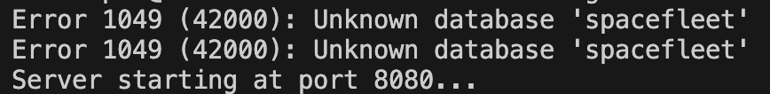

# spacefleet

In terminal
Error 1049 (42000): Unknown database 'spacefleet'
Error 1049 (42000): Unknown database 'spacefleet'

When you run the server and see this error make sure to install MySQL db and also make sure that you created table with the exact name. In our case 'spacefleet'

When you start the server and see this error, make sure that the MySQL database is installed and also make sure that you have created a table with the exact name. In our case, 'spacefleet'.

mysql> create database spacefleet;
mysql> show DATABASES;

+--------------------+
| Database           |
+--------------------+
| information_schema |
| mysql              |
| performance_schema |
| spacefleet         |
+--------------------+